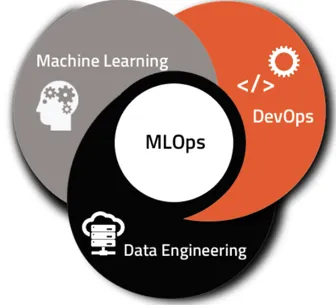

# SISTEMA DE RECOMENDACIÓN DE PELICULAS - MACHINE LEARNING OPERATIONS

  

## Descripción del proyecto
En este proyecto se busca desarrollar una API para consultas con un sistema de recomendación de películas utilizando datos de plataformas de Streaming. La API proporciona varios endpoints que permiten consultar información entre otras acerca de películas, directores y actores, pero lo más importante es la implementación de un sistema de recomendación de películas a través de un modelo de Machine Learning.

## Rol a desarrollar y desafíos iniciales
El rol general es el de **MLOps Engineer**.
En un primer momento se asume el rol de **Data Engineer** con el objetivo de crear un MVP (*Minimum Viable Product*) desde cero. En primer lugar, llevar a cabo un proceso de ETL (*Extract, Transform, Load*) para realizar las transformaciones necesarias en el dataset para poder acceder a la información precisa de manera fácil y eficiente. Como por ejemplo desanidar datos en diversas columnas y una serie de transformaciones propuestas:

•	Algunos campos, como **belongs_to_collection**, **production_companies** y otros (ver diccionario de datos) están anidados, esto es o bien tienen un diccionario o una lista como valores en cada fila. La propuesta es desanidar los datos e incluir los necesarios en el dataset.

•	Los valores nulos de los campos **revenue**, **budget** deben ser rellenados por el número 0.

•	Los valores nulos del campo **release_date** deben eliminarse.

•	De haber fechas, deberán tener el formato **AAAA-mm-dd**, además deberán crear la columna **release_year** donde extraerán el año de la fecha de estreno.

•	Crear la columna con el retorno de inversión, llamada **return** con los campos **revenue** y **budget**, dividiendo estas dos últimas revenue / budget, cuando no hay datos disponibles para calcularlo, deberá tomar el valor 0.

•	Eliminar las columnas que no serán utilizadas, **video**, **imdb_id**, **adult**, **original_title**, **poster_path** y **homepage**.

Por otro lado, se asume el rol de Data Scientist en una hipotética *start-up* que provee servicios de agregación de plataformas de *streaming*. Esto implica principalmente realizar un Análisis Exploratorio de los Datos (**EDA**), lo cual es indispensable para la creación de un modelo de *Machine Learning* que soluciona un problema de negocio: un sistema de recomendación de películas.

## Tecnologías utilizadas
Se utilizó Visual Studio Code, Jupyter Notebook y Python con las siguientes librerías:

•	Pandas

•	Numpy

•	Scikit-Learn

•	FastAPI

•	Matplotlib

•	Seaborn

•	Uvicorn

•	Wordcloud

•	SciPy.stats

•	Re

•	Ast

## Metodología

### Transformación de datos
Principalmente se trabaja en la lectura del dataset en el formato correcto, eliminando columnas innecesarias, creando nuevas columnas, desanidando datos para conservar solo los útiles, y realizando las transformaciones solicitadas y necesarias para mantener los datos esenciales para resolver las consultas. A partir del proceso de ETL se exportan dos archivos de tipo parquet, [df_filtrado.parquet](https://github.com/EliLarregola/Recomendacion_Streaming/blob/main/df_filtrado.parquet) es aquel utilizado para seguir con el proceso de EDA y por otro lado [streaming_functions.parquet](https://github.com/EliLarregola/Recomendacion_Streaming/blob/main/streaming_functions.parquet) es aquel utilizado para responder a las consultas en la API.

*Nota: El proceso de ETL realizado en esta etapa puede verse con detalle en el notebook [ETL_Streaming](https://github.com/EliLarregola/Recomendacion_Streaming/blob/main/ETL_Streaming.ipynb).*

### Análisis Exploratorio de Datos (EDA)
El análisis exploratorio de datos se comienza a realizar con un dataset previamente tratado en la etapa de ETL, llamado [df_filtrado.parquet]( https://github.com/EliLarregola/Recomendacion_Streaming/blob/main/df_filtrado.parquet). El objetivo de esta etapa es identificar relaciones entre variables, detectar anomalías y outliers y descubrir patrones que sean útiles para entender los datos y decidir qué utilizar para el modelo. A partir de este proceso se obtiene un archivo [streaming_model.parquet](https://github.com/EliLarregola/Recomendacion_Streaming/blob/main/streaming_model.parquet), el cual es utilizado para el modelo de recomendación.

*Nota: El proceso de EDA realizado en esta etapa puede verse con detalle en el notebook [EDA](https://github.com/EliLarregola/Recomendacion_Streaming/blob/main/ETL_Streaming.ipynb).*

### Desarrollo de la API
Se propone disponibilizar los datos de la empresa usando el *framework* **FastAPI** y desplegarlo a través de [RENDER]( https://render.com/). 
Se crean 6 funciones para los *endpoints* que se consumen en la API, estas funciones se pueden observar en el archivo [main.py](https://github.com/EliLarregola/Recomendacion_Streaming/blob/main/main.py). Las consultas propuestas son las siguientes:

•	def **cantidad_filmaciones_mes**( *Mes* ): Se ingresa un mes en idioma Español. Debe devolver la cantidad de películas que fueron estrenadas en el mes consultado en la totalidad del dataset.
                    
                    
•	def **cantidad_filmaciones_dia**( *Dia* ): Se ingresa un día en idioma Español. Debe devolver la cantidad de películas que fueron estrenadas en día consultado en la totalidad del dataset.
                   
                   
•	def **score_titulo**( *titulo_de_la_filmación* ): Se ingresa el título de una filmación esperando como respuesta el título, el año de estreno y el score.
                   
                   
•	def **votos_titulo**( *titulo_de_la_filmación* ): Se ingresa el título de una filmación esperando como respuesta el título, la cantidad de votos y el valor promedio de las votaciones. La misma variable deberá de contar con al menos 2000 valoraciones, caso contrario, debemos contar con un mensaje avisando que no cumple esta condición y que por ende, no se devuelve ningun valor.
                   
                   
•	def **get_actor**( *nombre_actor* ): Se ingresa el nombre de un actor que se encuentre dentro de un dataset debiendo devolver el éxito del mismo medido a través del retorno. Además, la cantidad de películas que en las que ha participado y el promedio de retorno. La definición no deberá considerar directores.
                   
                   
•	def **get_director**( *nombre_director* ): Se ingresa el nombre de un director que se encuentre dentro de un dataset debiendo devolver el éxito del mismo medido a través del retorno. Además, deberá devolver el nombre de cada película con la fecha de lanzamiento, retorno individual, costo y ganancia de la misma.

### Sistema de recomendación
El sistema de recomendación es una función disponible en la API que utiliza el modelo de similitud de coseno. Este modelo es común en la búsqueda de información y el filtrado colaborativo, y sirve para encontrar películas similares basadas en su contenido.

En este proyecto, calculamos la similitud de coseno entre vectores de características que representan distintas películas. Estos vectores incluyen información como el género y el resumen de cada película. Una vez calculada la similitud de coseno, el sistema identifica las cinco películas más similares y las recomienda al usuario.

Para realizar este cálculo, utilizamos los módulos *TfidfVectorizer* y *cosine_similarity* de la biblioteca de *Python Scikit-learn*.

## Conclusiones
Teniendo en cuenta el objetivo de crear un MVP (*Minimum Viable Product*) desde cero en un tiempo determinado, es importante destacar que el MVP fue implementado con éxito dentro del tiempo establecido. Esto implica que se logra desarrollar un sistema funcional que cumple con los requisitos mínimos esperados.
Por otro lado, mencionar las áreas en las que se podrían realizar mejoras es fundamental. Esto incluye considerar variables adicionales como compañías productoras, directores y popularidad para mejorar la precisión y la relevancia de las recomendaciones. 
Es útil mencionar explícitamente las decisiones tomadas, como la optimización del tiempo y la memoria, que llevaron a dejar algunas mejoras para trabajos futuros. Esto demuestra una planificación consciente y la capacidad de priorizar características y optimizaciones dentro de las limitaciones del proyecto.

**Se puede ingresar a la API a través de este [link](https://recomendacion-streaming.onrender.com/Docs) para poder ejecutar las consultas.**

## **Fuente de datos**

+ [Dataset](https://drive.google.com/drive/folders/1X_LdCoGTHJDbD28_dJTxaD4fVuQC9Wt5?usp=drive_link): Carpeta con los 2 archivos con datos que requieren ser procesados (movies_dataset.csv y credits.csv), tengan en cuenta que hay datos que estan anidados (un diccionario o una lista como valores en la fila).
+ [Diccionario de datos](https://docs.google.com/spreadsheets/d/1QkHH5er-74Bpk122tJxy_0D49pJMIwKLurByOfmxzho/edit#gid=0): Diccionario con algunas descripciones de las columnas disponibles en el dataset.
 

## Contacto
Eliana Larregola

[LinkedIn](https://recomendacion-streaming.onrender.com/Docs)
[GitHub](https://github.com/EliLarregola)
